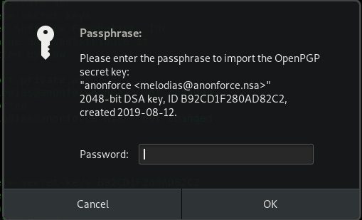

# Anonforce

## Reconnaissance

ip address : 10.10.150.198

## Scanning & Enumeration

### Nmap Scan

Scan for open port and serices version

```shell
nmap -A -T4 -p- -oN nmap/all_port 10.10.150.198
```

scan result can be found [here](nmap/all_port)

interesting open port are  :
| port number | service | version |
| --- | --- | --- |
| 21 | ftp | vsftpd 3.0.3 |
| 22 | ssh | OpenSSH 7.2p2 |

No web port available for this room.

## Exploiting

### FTP Exploitation

* User Dir

The ftp service allow anonymous login, so let enumerate it.


the ftp server root dir is set to / witch is very good for us.
This allow us to get the user flag pretty easily.

* NoRead Dir

By looking to noread dir we found a pgp encrypted [file](finding) and is key.

* Decrypting
  
```shell
gpg --import private.asc
```



The decyption need a secret key.

Let's crack the gpg key with john.

```shell
 gpg2john private.asc > private.hash
```

and crack the hash

```shell
john private.hash
```

we ash is cracked very quickly.

After succesfully decrypted the found we found that it a backup of the shadow file.
[file here]

### Hashcat Cracking

```shell
 hashcat -m 1800 --hwmon-disable backup.txt /usr/share/wordlists/rockyou.txt --force
```

this command allow us to crack the root password, so we can access the machine to grab the root flag

### Root Access


this box is done.