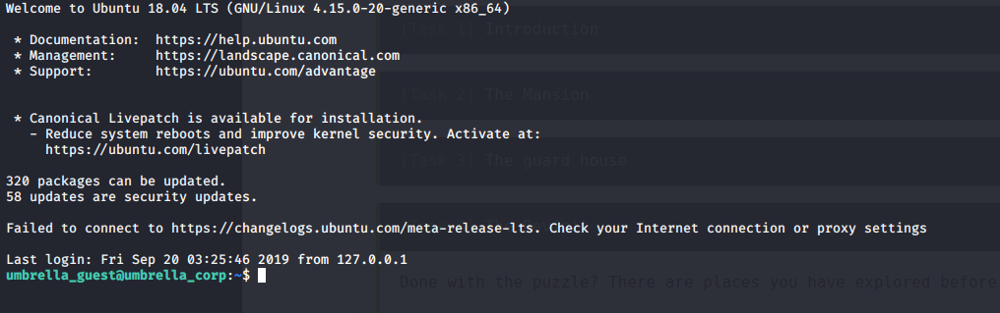
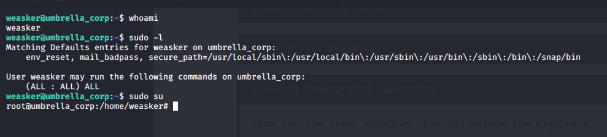

# Biohazard

## Reconnaissance

IP addr : 10.10.217.68

## Scanning & Enumeration

### Nmap Port Scanning

scan result is [here](nmap/initial)

### Http (port 80) Enumeration

## The Mansion

The STARS alpha team, Chris, Jill, Barry, Weasker and Joseph

- start room
- digging room
- tea room
- art room
- [map](map.txt)

### Crest

- Crest 1: base64 -> base32
- Crest 2: base32 -> base58
- Crest 3: base64 -> binary -> hex
- Crest 4: base58 -> hex

crest1+crest2+crest3+crest3 ==> base64
we got FTP Creds

## The guard house

key string : cGxhbnQ0Ml9jYW5fYmVfZGVzdHJveV93aXRoX3Zqb2x0
and finaly got to decode the helmet key

## The Revisit

found ssh creds

## Underground laboratory

found weasker creds with is sudo user

