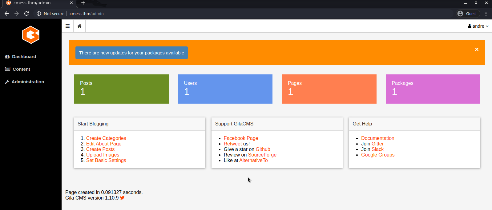
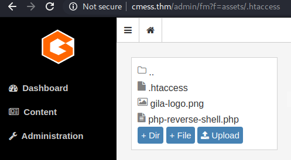
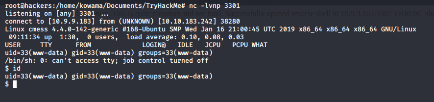
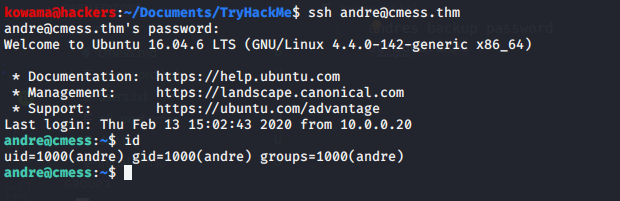

# CmesS

## Enumeration

### Nmap Scan

```bash
nmap -A -T4 -oN nmap/initial $TARGET
```

open port are :
| port | service | version |
| --- | --- | --- |
| 22/tcp | ssh | OpenSSH 7.2p2 |
| 80/tcp | http | httpd 2.4.18 |

### Http 80 Enumeration

- robots.txt
- Gila cms

by looking on the web gila cms is vulenerable to [CVE 2019-16679](https://www.exploit-db.com/exploits/47407) for version < 1.11.1
but this exploit need to be authenticated.

#### User account

By making some DNS enumartion we found a subdomain <http://***.cmess.thm> using this subdomain we got credentials to login.



## Exploitation

### User Shell

#### [CVE 2019-16679](https://www.exploit-db.com/exploits/47407)  exploitation

We are not going to exploit this

#### Shell upload

we use ours admin access to upload a php reverse shell


### Geting a user shell

```bash
nc -lvnp $LPORT
```

and follow the link <http://cmess.thm/assets/php-reverse-shell.php>



## Privilege Escalation

### linPEAS

- /var/www/html/src/core/views/admin/settings.php
-/var/www/html/src/Cocur/Slugify/bin
-/opt/.password.bak

by looking at [/opt/.password.bak](..password.bak) we found andre password



### Get Root
