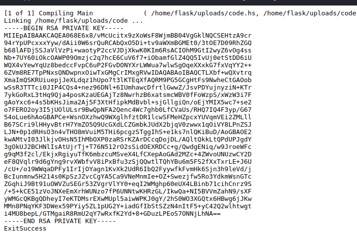
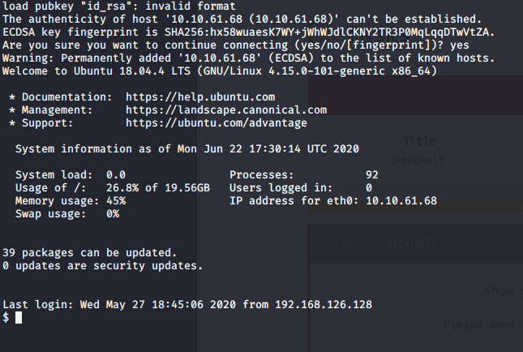
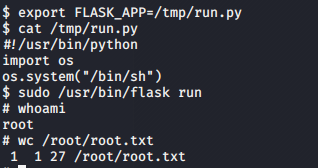

# HaskHell

## Enumeration

### Nmap scan

```bash
nmap -A -p- -T4 -oN nmap/initial $TARGET
```

a full port scan give use the follwing result [here](/nmap/all_port)
| port | service | version |
| --- | --- | --- |
| 22/tcp  | ssh |  OpenSSH 7.6p1 |
| 5001/tcp | http | gunicorn/19.7.1 |

OpenSSH 7.6p1 is vulnerable to [CVE 2018-15473](https://www.exploit-db.com/exploits/45210)

### Http Enumeration

Let explore the website <http://TARGET:5001/>

- <http://TARGET:5001/submit> file uploads
- the code uploaded is run on the system

so let write some [malicious code](code.hs)

using it to to run systems commands



## Exploitation

### User shell

with the username:id_rsa key and we got a user shell


## Privilege Escalation

## Enum with LinPEAS

- sudo verion 1.8.21 [CVE 2012-0809](https://www.exploit-db.com/exploits/25134)
- User prof may run the following commands on haskhell:
    (root) NOPASSWD: /usr/bin/flask run


