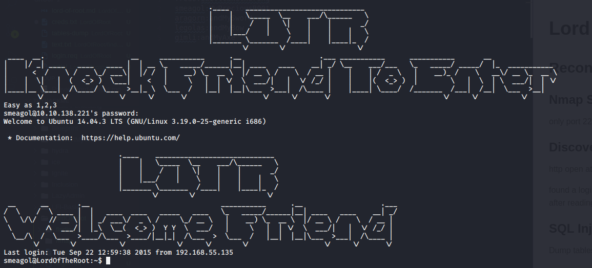
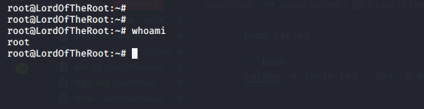

# Lord Of The Root

## Reconnaissance

### Nmap Scan

only port 22(ssh) is open

### Discover open port

http open at 1337 :<http://10.10.138.221:1337/>

found a login page at : /978345210/index.php
after reading [robots.txt](finding/text.txt)

### SQL Injection

Dump tables

```bash
sqlmap -r login.req --dbs -D Webapp —tables --level 3
```

Dump Users

```bash
sqlmap -r login.req --dbs --level 3 -D Webapp -T Users --dump

```

found [credentials](finding/text.txt) to test on ssh

only one work :
smeagol:MyPreciousR00t

## Exploitation

### User Shell



### Root shell

the linux version is vulnerable to [CVE2015-8660](https://www.exploit-db.com/exploits/39166)

