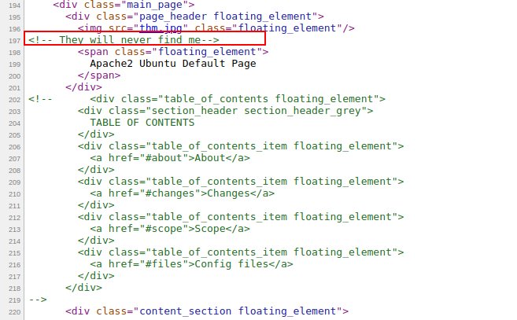
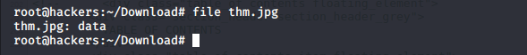
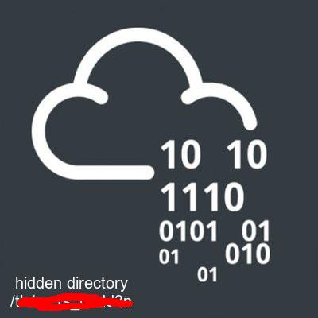
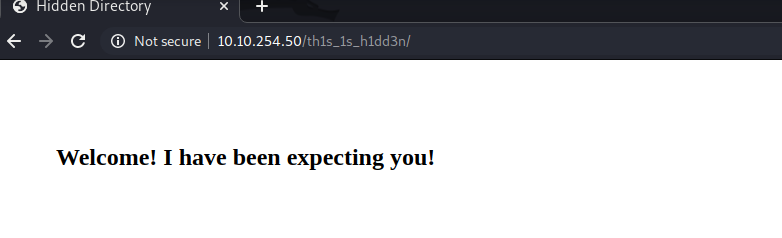
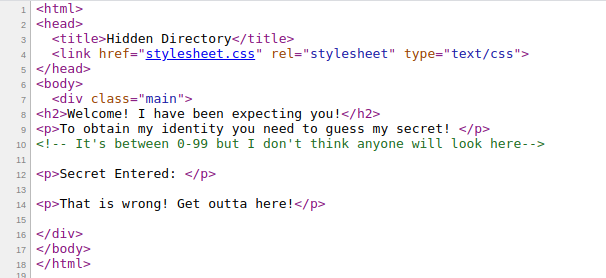
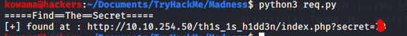
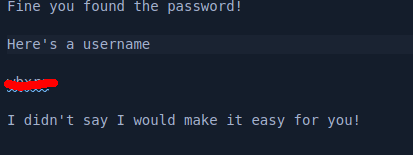
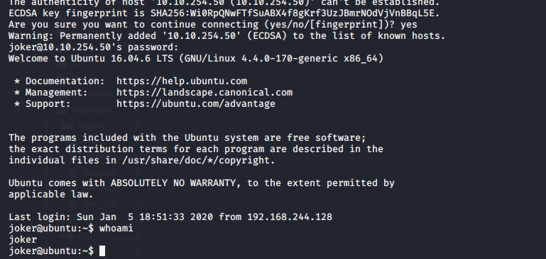
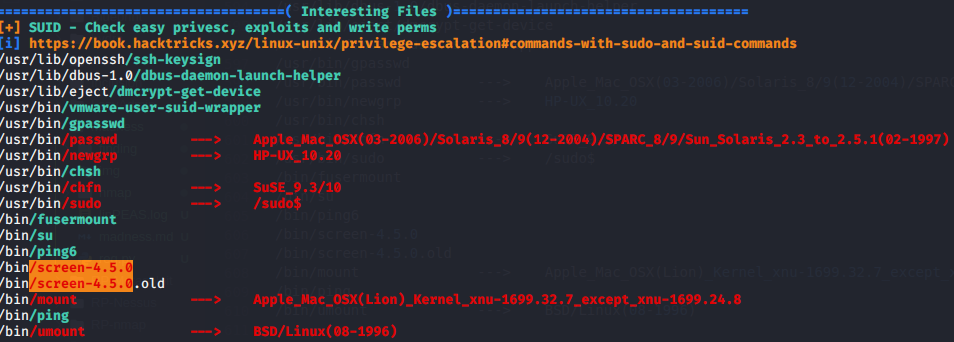
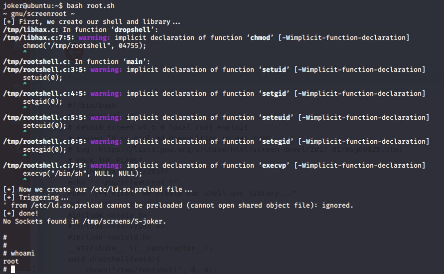

# Madness

## Reconnaissance

ip address : 10.10.254.50

## Scanning & Enumeration

* Nmap Scan

```shell
nmap -A -T4 -p- -oN nmap/all_port 10.10.254.50
```

the scan result is [here](nmap/all_port)

interesting Open Port are

| port number | service | version |
| --- | --- | --- |
| 22 | ssh | OpenSSH 7.2p2 Ubuntu |
| 80 | http | Apache httpd 2.4.18 ((Ubuntu)) |

* Enumerating the web page
we got some interesting hint by visiting the website and looking up to the source code.



* Gobuster Scan

```shell
gobuster dir -w /usr/share/wordlists/dirbuster/directory-list-2.3-medium.txt  -u http://10.10.254.50
```

gobuster scan found nothing interesting

### Stego
  
Let's try to decode the hint given on the website. by applying some stego on the image [thm.jpg](finding/thm.jpg)

* file type
  
```shell
file thm.jpg
```



after what we know this file is not regular .jpg image.

* Let's find it real nature
by oppening the file with hexeditor we found what it's [magic number](https://en.wikipedia.org/wiki/List_of_file_signatures) has been change to PNG

* Let's retore the file
after changing back the magic number to [jpg](https://gist.github.com/leommoore/f9e57ba2aa4bf197ebc5) we found this :


which give us some hidden directory

#### Enumerate the hidden page



### Here,  we go again



```shell
curl http://10.10.254.50/th1s_1s_h1dd3n/index.php?secret=x
```

is the way to submit the secret x, since we know that let do the work with python.

Ours [python script](req.py) do is job very well

and we found the right value.

The got a [password](finding/creds.txt) but not is username.

### Struggle Again

after struggling to find what the password is for i decide to use it with the image [thm.jpg](finding/thm.jpg)

```shell
steghide extract -sf thm_normal.jpg
```

we found the username but it's encrypted


* Crazy

this time it's a easy one it a rot13 encryption

#### Real madness

Now we have found a username and a password we try to login with ssh but they don't go together. so the decide to find another way

* Let steghide one the room banner

```shell
steghide extract -sf room.jpg
```

finally we got the username and password

## Exploitation

* Let SSH in the box
  

we can know grab the user flag

### Priileged Escalation

* LinPEAS
the scan result is [here](linPEAS.log)

```shell
find / -type f -user root -perm -4000 -exec ls -ldb {} \; 2>>/dev/null
```

we got the following anormal SUID


* Exploit the SUID

we found a  exploit on [seachsploit](https://www.exploit-db.com/exploits/41154)

and we got our root shell


