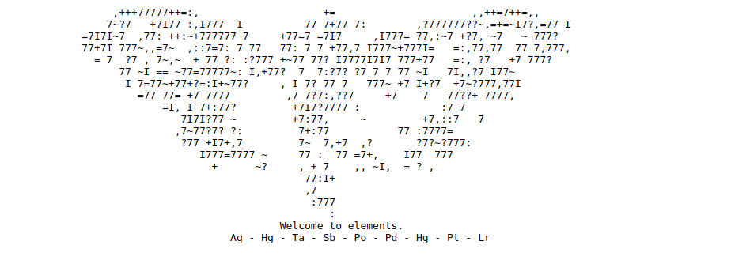
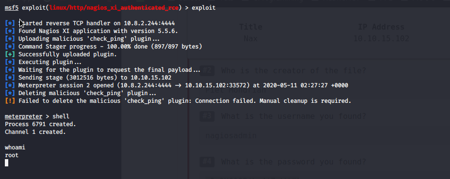

# Nax

## Reconnaissance

IP addr : 10.10.15.102

## Scanning & Enumeration

### Nmap Scan

result [here](nmap/initial)

### Http Enumeration

Nagios at <http://10.10.15.102/nagiosxi/login.php>

### SMTP Enumeration

smtp enumeration with msf :
ubuntu.localdomain

### Stego Challenge



| code | Ag | Hg | Ta | Sb | Po | Pd | Hg | Pt | Lr |
| --- | --- | --- | --- | --- | --- | --- | --- | --- | --- |
| number | 47 | 80 | 73 | 51 | 84 | 46 | 80 | 78 | 103 |

> 4780735184468078103 to ASCII==>/PI3T.PNg

a image file created by Piet Mondrian

taking the artist name in consideration the image is a [Piet](https://www.dangermouse.net/esoteric/piet.html) encrypted files.
wich can be decrypted <https://www.bertnase.de/npiet/npiet-execute.php>

finaly found username and passwords

If can finally login

## Exploitation

### CVE-2019-15949

The nagios version is is vulnerable to [CVE-2019-15949](https://www.exploit-db.com/exploits/46221)

### Let Exploit it with msf

```shell
use exploit/linux/http/nagios_xi_authenticated_rce
```

