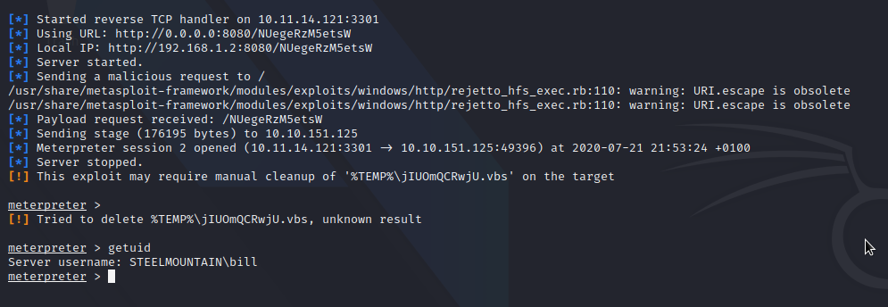
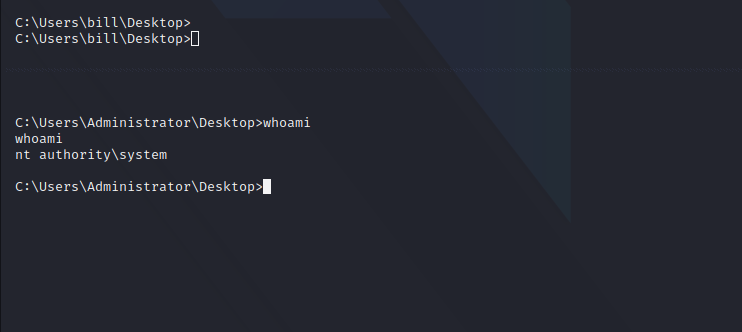

# Steel Mountain

## Enumeration

```bash
nmap -A -T4 -oN nmap/initial $TARGET
```

open port are [here](nmap/initial)

Rejetto HTTP File Server (HFS) 2.3.x is vunerable to [CVE-2014-6287](https://www.exploit-db.com/exploits/39161) that alow RCE

## Exploitation



## Privilege escalation

* upload [PowerUp.ps1](https://github.com/PowerShellMafia/PowerSploit/blob/master/Privesc/PowerUp.ps1)

* [load powershell] and run it

```bash

ServiceName    : AdvancedSystemCareService9
Path           : C:\Program Files (x86)\IObit\Advanced SystemCare\ASCService.exe
ModifiablePath : @{ModifiablePath=C:\; IdentityReference=BUILTIN\Users; Permissions=AppendData/AddSubdirectory}
StartName      : LocalSystem
AbuseFunction  : Write-ServiceBinary -Name 'AdvancedSystemCareService9' -Path <HijackPath>
CanRestart     : True

ServiceName    : AdvancedSystemCareService9
Path           : C:\Program Files (x86)\IObit\Advanced SystemCare\ASCService.exe
ModifiablePath : @{ModifiablePath=C:\; IdentityReference=BUILTIN\Users; Permissions=WriteData/AddFile}
StartName      : LocalSystem
AbuseFunction  : Write-ServiceBinary -Name 'AdvancedSystemCareService9' -Path <HijackPath>
CanRestart     : True

ServiceName    : AWSLiteAgent
Path           : C:\Program Files\Amazon\XenTools\LiteAgent.exe
ModifiablePath : @{ModifiablePath=C:\; IdentityReference=BUILTIN\Users; Permissions=AppendData/AddSubdirectory}
StartName      : LocalSystem
AbuseFunction  : Write-ServiceBinary -Name 'AWSLiteAgent' -Path <HijackPath>
CanRestart     : False

```

Let Hijack AdvancedSystemCareService9 Service Path

generate a windows reverse shell with msfvenom

```bash

```

