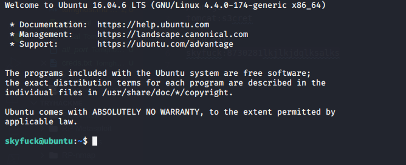
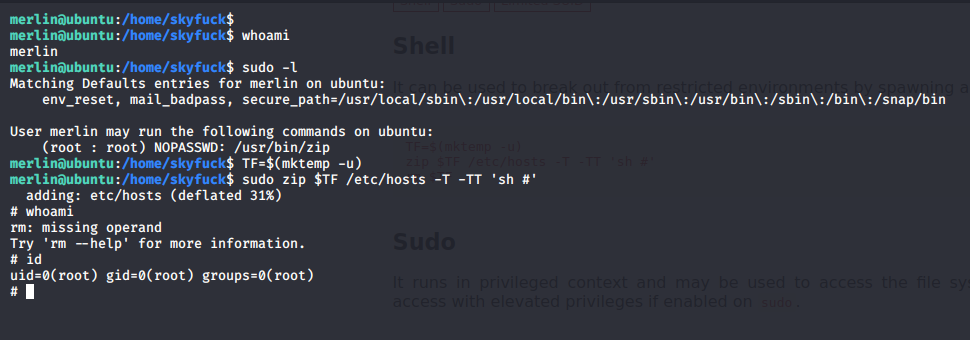

# Tomghost

## Reconnaissance

IP Addr : 10.10.33.180

## Scanning & Enumeration

### Nmap San

scan for open port : [here](nmap/initial)

## Exploitation

### CVE 2020-1938

The Apache Tomcat version is vulnerable to [CVE2020-1938](https://www.exploit-db.com/exploits/48143)

### Let exploit it

with this exploit we are able to read local file
[web.xml](web.xml)

## User Shell

Let Ssh in the machine with the creds we found

## Root Shell

crack the file found in user dir allows us to get a shell as merlin.

[GTFOBin](https://gtfobins.github.io/gtfobins/zip/) and root

