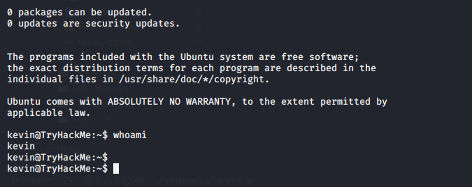

# Tweety CTF

## Reconnaissance

IP Addr : 10.10.34.105

## Scanning & Enumeration

### Nmap Scan

open port are 81(ssh) 80(http), 8080(htttp tomcat), 139/445(samba), 2121(ftp).
The scan result is [here](nmap/initial)

### Http(80) enumeration

* stego
* OSINT <https://twitter.com/sammythm>
* Wireshark

found some creds for ftp

### SMB

* enumeration
* brute force zach
* thanks.txt
* port knocking

## Exploitation

### User Shell

### Root flag

cron job