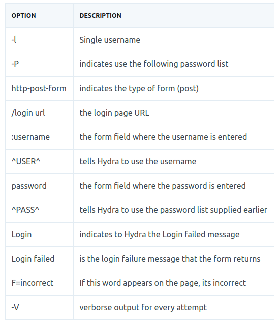
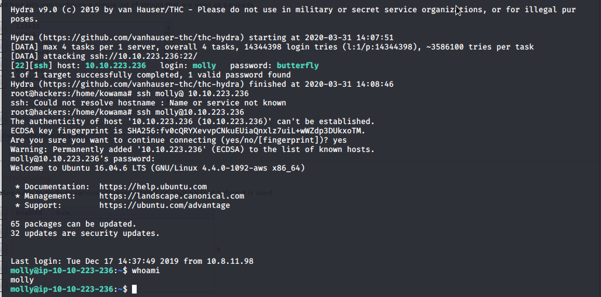

# Hydra 

### What is Hydra?
Hydra is a brute force online password cracking program; a quick system login password 'hacking' tool.

We can use Hydra to run through a list and 'bruteforce' some authentication service. Imagine trying to manually guess someones password on a particular service (SSH, Web Application Form, FTP or SNMP) - we can use Hydra to run through a password list and speed this process up for us, determining the correct password.

---

### Using Hydra

* #### Hydra Commands
The options we pass into Hydra depends on which service (protocol) we're attacking. For example if we wanted to bruteforce FTP with the username being user and a password list being passlist.txt, we'd use the following command:
```
hydra -l user -P passlist.txt ftp://192.168.0.1
```
For the purpose of this deployed machine, here are the commands to use Hydra on SSH and a web form (POST method)
* **SSH** 
```
hydra -l <username> -P <full path to pass> <ip> -t 4 ssh
```

| Option   |  Description |
|----------|---------------|
| -l | is the username
| -P | is the password list |
| -t | specifie the number of threads|

* **Post Web Form**



* **Practice** 

Web login
molly:sunshine[with burpsuite]

SSH login



---