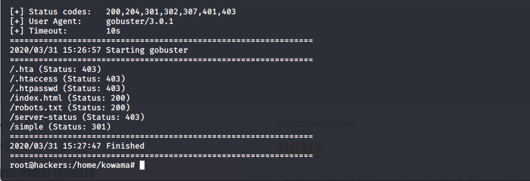
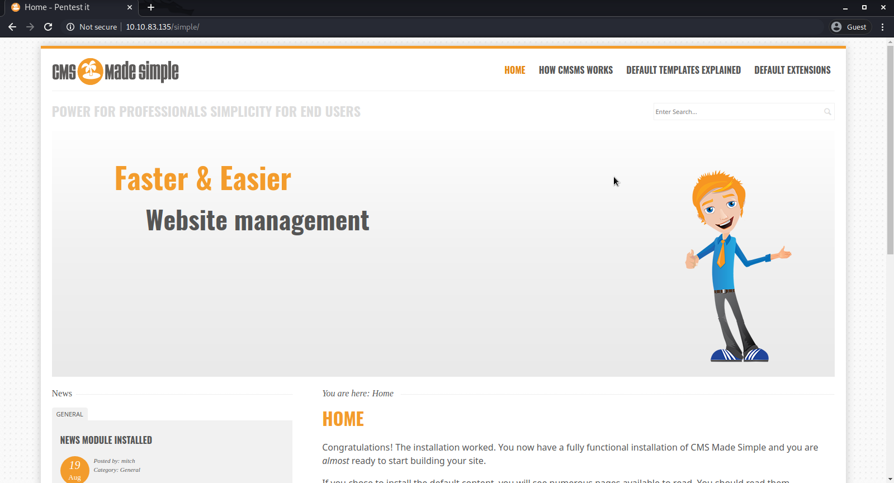

# Simple CTF 
## Reconnaissance
 * #### IP address : 10.10.83.135

---
## Scanning & Enumeration
* #### Nmap scan
```
Host is up (0.11s latency).
Not shown: 997 filtered ports
PORT     STATE SERVICE VERSION
21/tcp   open  ftp     vsftpd 3.0.3
| ftp-anon: Anonymous FTP login allowed (FTP code 230)
|_Can't get directory listing: TIMEOUT
| ftp-syst: 
|   STAT: 
| FTP server status:
|      Connected to ::ffff:10.9.0.92
|      Logged in as ftp
|      TYPE: ASCII
|      No session bandwidth limit
|      Session timeout in seconds is 300
|      Control connection is plain text
|      Data connections will be plain text
|      At session startup, client count was 4
|      vsFTPd 3.0.3 - secure, fast, stable                                                                                                                               
|_End of status                                                                                                                                                          
80/tcp   open  http    Apache httpd 2.4.18 ((Ubuntu))                                                                                                                    
| http-robots.txt: 2 disallowed entries                                                                                                                                  
|_/ /openemr-5_0_1_3                                                                                                                                                     
|_http-server-header: Apache/2.4.18 (Ubuntu)                                                                                                                             
|_http-title: Apache2 Ubuntu Default Page: It works                                                                                                                      
2222/tcp open  ssh     OpenSSH 7.2p2 Ubuntu 4ubuntu2.8 (Ubuntu Linux; protocol 2.0)                                                                                      
| ssh-hostkey:                                                                                                                                                           
|   2048 29:42:69:14:9e:ca:d9:17:98:8c:27:72:3a:cd:a9:23 (RSA)                                                                                                           
|   256 9b:d1:65:07:51:08:00:61:98:de:95:ed:3a:e3:81:1c (ECDSA)                                                                                                          
|_  256 12:65:1b:61:cf:4d:e5:75:fe:f4:e8:d4:6e:10:2a:f6 (ED25519)                                                                                                        
Service Info: OSs: Unix, Linux; CPE: cpe:/o:linux:linux_kernel   
```

* #### Gobuster 

Drirectory discovry :
```
gobuster dir -u http://10.10.83.135/ -w /usr/share/dirb/wordlists/common.txt 
```


* #### CMS made simple



This app is vulnerale to SQL Injection [CVE-2019-9053](https://www.exploit-db.com/exploits/46635)

---
## Explotaiton

---
## Maintainning Access

---
## Cleaning

---
